# [poc] chat-gpt app
The objective is to understand how to use chat-gpt api and device a better architecture.

## Architecture
The image is compositions of our chat-gpt app.



## [WIP]Development guide
1. Create an account on OpenAI
2. Create your API key
3. Execute following command
```
cp .env.sample .env
```
4. Paste API key on `.env`
5. Build containers
```
docker-compose build --no-cache
```
6. Start containers
```
docker-compose up -d
```
7. Throw test request
```
curl -d '{"question":"Who are you?"}' http://localhost:9000/2015-03-31/functions/function/invocations
```

## Reference
- OpenAI...https://platform.openai.com/docs/quickstart/build-your-application